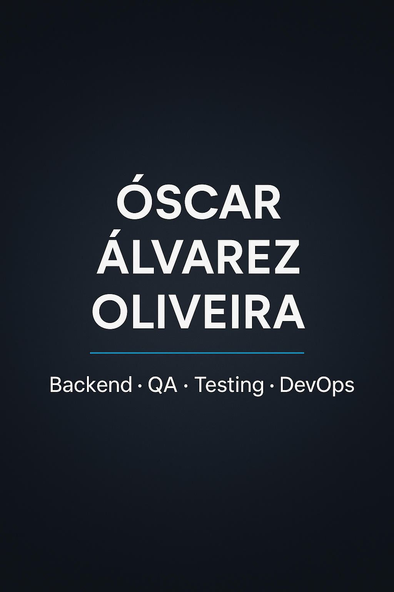

# 🌐 Portfolio Profesional — Óscar Álvarez Oliveira

Este es mi portfolio personal, donde presento mis proyectos más relevantes como **Backend Developer** especializado en **QA**, **Testing Automatizado** y **DevOps**.  

Incluye práctica real con Java, Selenium, Docker, CI/CD, infraestructura en la nube y herramientas orientadas a la calidad del software.

---

## 🚀 Demo en Producción  
**🔗 https://oalvarezoliveira.github.io**



---

## 🧑‍💻 Sobre mí

Soy desarrollador en formación, enfocado en construir soluciones backend eficientes con **Java**, aplicar buenas prácticas de ingeniería y reforzar la calidad mediante **testing automatizado**, **CI/CD** y procesos DevOps.

Actualmente estudio **Desarrollo de Aplicaciones Multiplataforma (DAM)** y complemento mi formación con certificaciones y proyectos reales orientados a empresa.

---

## 🛠️ Tech Stack Principal

### **Lenguajes**
- Java  
- PHP  
- SQL / MySQL  
- JavaScript  
- HTML5 / CSS3  

### **QA & Testing**
- Selenium WebDriver  
- JUnit  
- Postman  
- Appium  
- Jira  

### **DevOps & Cloud**
- Docker  
- Kubernetes  
- Azure  
- AWS  
- Terraform  
- Ansible  
- Jenkins  

### **Herramientas**
- Git & GitHub  
- Bash  
- Linux  
- VSCode  

---

## 📦 Proyectos Destacados

### ▶ **Despliegue Cloud Automatizado en Azure**
Infraestructura completa automatizada mediante **Terraform**, **Ansible** y **Kubernetes**.  
🔗 https://github.com/OAlvarezOliveira/despliegue-cloud-automatizado

---

### ▶ **ToDo List AWS — CI/CD con SAM y Jenkins**
API serverless desplegada con AWS SAM y pipeline CI/CD usando Jenkins.  
🔗 https://github.com/OAlvarezOliveira/todo-list-aws

---

### ▶ **WooCommerce Engel Integration**
Plugin profesional para integración y sincronización de productos en WooCommerce.  
🔗 https://github.com/OAlvarezOliveira/woocommerce-engel-integration

---

### ▶ **Pruebas Automatizadas con Selenium**
Suite E2E con Selenium WebDriver, JUnit y patrones de automatización.  
🔗 https://github.com/OAlvarezOliveira/Selenium

---

## 📁 Estructura del Proyecto

/
├── index.html # Página principal
├── style.css # Estilos y responsive design
├── script.js # Interactividad, tabs, scroll, tema...
├── assets/ # Recursos multimedia
│ ├── preview.png # Imagen Open Graph
│ ├── profile.jpg # Foto de perfil
│ └── CV.pdf # Curriculum descargable
└── CNAME (opcional)

yaml
Copiar código

---

## 💻 Ejecutar en local

1. Clona el repositorio:  
   ```bash
   git clone https://github.com/OAlvarezOliveira/OAlvarezOliveira.github.io
Entra en la carpeta:

bash
Copiar código
cd OAlvarezOliveira.github.io
Abre index.html en tu navegador.
No requiere servidor: todo es estático y compatible con GitHub Pages.

📫 Contacto
📧 Email: oalvarezoliveira@gmail.com
🐙 GitHub: https://github.com/OAlvarezOliveira
🔗 LinkedIn: https://www.linkedin.com/in/oscar-alvarez-oliveira-462877241/

📜 Licencia
Este proyecto está publicado bajo la MIT License.
Puedes consultarla y reutilizar el código respetando sus términos.

⭐ Si te gusta este portfolio…
¡Puedes dejar una estrella ⭐ en GitHub para apoyar el proyecto!